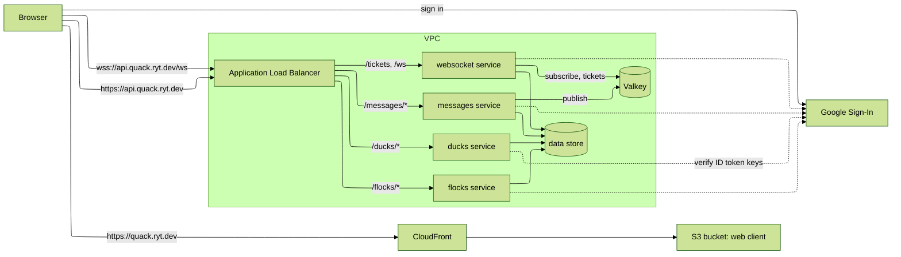

# Architecture

Quack is a set of Node services on ECS Fargate behind one Application Load Balancer, a static web client on S3 behind CloudFront, a shared data store, and a Valkey node that fans messages out between tasks. Everything runs in one AWS account in us-east-1. Public hostnames are subdomains of quack.ryt.dev with DNS in Cloudflare.

## Components

| Component                 | Runs as                                                                                                                                 | Stack               |
| ------------------------- | --------------------------------------------------------------------------------------------------------------------------------------- | ------------------- |
| Web client                | Static files on S3, served by CloudFront at quack.ryt.dev                                                                               | web                 |
| Application Load Balancer | HTTPS listener on api.quack.ryt.dev; path rules to services; WebSocket upgrades pass through                                            | cluster             |
| `ducks` service           | ECS Fargate service; sign-in upsert and user lookup                                                                                     | ducks               |
| `flocks` service          | ECS Fargate service; flocks and memberships                                                                                             | flocks              |
| `messages` service        | ECS Fargate service; send and history                                                                                                   | messages            |
| `websocket` service       | ECS Fargate service; tickets, socket sessions, live delivery                                                                            | websocket           |
| Data store                | Shared by all services; each entity owned by one domain                                                                                 | one stack per store |
| Valkey                    | ElastiCache node; pub/sub between tasks and ticket storage                                                                              | valkey              |
| Network                   | VPC, public subnets for the load balancer, private subnets for tasks and Valkey                                                         | network             |
| Certificates              | ACM in us-east-1; one for quack.ryt.dev on CloudFront, one for api.quack.ryt.dev on the load balancer; validated by CNAME in Cloudflare | web, cluster        |

## Request paths

HTTP: the browser sends the ID token as a bearer token. The load balancer routes by path to one service. The service verifies the token, applies the authorization rule for the route, reads or writes the data store, and responds. A send also publishes the message to the flock's Valkey topic.

WebSocket: the browser calls the tickets route with its bearer token and receives a one-time ticket. It opens the socket with the ticket in the query string. The websocket service redeems the ticket, binds the socket to the user, and subscribes to the topic of each flock the user belongs to. When a message is published to a subscribed topic, the service pushes it to every socket on that task whose user is a member. On close it drops the socket and unsubscribes from topics no remaining socket needs.

## Security

- Identity comes from an OpenID Connect ID token issued by Google to the web client. Every service verifies signature, issuer, expiry, and audience in code against Google's published keys, cached in memory (ADR-006). No credentials are stored.
- WebSocket upgrades from a browser cannot carry an Authorization header, so the socket path uses a ticket: a random value stored in Valkey with the user's identity and a short expiry, returned by the tickets route to an authenticated caller. Redeeming a ticket deletes it, so it is single use. An unknown or expired ticket closes the socket.
- Authorization is record level: membership of the flock for any read or write to it, ownership for delete. Each service enforces the rule for its routes before touching the data store.
- Tasks and Valkey sit in private subnets. Security groups allow the load balancer to the services, and the services to the data store and Valkey. Nothing else reaches them.
- The load balancer sets CORS response headers with the origin fixed to quack.ryt.dev.
- There is no request throttling in the MVP.

## Configuration

CDK reads a small set of values at synth: the web hostname, the API hostname, the Google OAuth client ID, and the region. Services receive what they need as environment variables set in their task definitions. When a stack needs a value another stack created, such as the cluster name or the listener, the producing stack writes it to an SSM parameter and the consuming stack reads it at deploy time. CloudFormation exports are not used.

The only secret-like value is the OAuth client ID, which is public by design. There are no application secrets.

## Cross-domain reads

Each domain owns its entities and is the only writer. A service may read another domain's records under the rule in ADR-008. Every such read is listed here.

| Reading service | Owning domain | Record     | Purpose                                                      |
| --------------- | ------------- | ---------- | ------------------------------------------------------------ |
| messages        | flocks        | membership | Membership check before send and before history              |
| websocket       | flocks        | membership | Topics to subscribe on connect; membership check before push |
| flocks          | ducks         | duck       | Existence check when adding a member                         |

## Tenancy

The MVP serves one tenant with a fixed tenant ID. Every record carries the tenant ID in its key and every query is scoped by it. Multi-tenancy is a named future enhancement (FC-01): the tenant ID would come from the request context, such as a claim or the hostname, instead of a constant. Nothing else is built for it.

## Stacks

One repository. Each row is a CDK stack in its own project; independent stacks deploy in parallel.

| Stack                              | Contents                                                                                       | Depends on                  |
| ---------------------------------- | ---------------------------------------------------------------------------------------------- | --------------------------- |
| network                            | VPC, subnets, NAT or endpoints for image pulls                                                 | none                        |
| data store                         | One stack per shared store                                                                     | network                     |
| valkey                             | ElastiCache node, subnet group, security group                                                 | network                     |
| cluster                            | ECS cluster, load balancer, HTTPS listener, certificate, SSM parameters for the service stacks | network                     |
| ducks, flocks, messages, websocket | Task definition, service, target group, listener rule, scaling policy, log group               | cluster, data store, valkey |
| web                                | S3 bucket, CloudFront distribution, certificate                                                | none                        |

Shared code (token verification, data access, Valkey client, logging) is a workspace package used by every service.

## Decisions

- [ADR-001](../adr/adr-001-hostnames-and-dns.md) public hostnames and DNS
- [ADR-002](../adr/adr-002-compute.md) compute
- [ADR-003](../adr/adr-003-capacity-provider.md) ECS capacity provider
- [ADR-004](../adr/adr-004-http-entry-point.md) HTTP and WebSocket entry point
- [ADR-005](../adr/adr-005-fan-out-between-tasks.md) fan-out between tasks
- [ADR-006](../adr/adr-006-token-verification.md) ID token verification
- [ADR-007](../adr/adr-007-stack-layout.md) repository and stack layout
- [ADR-008](../adr/adr-008-cross-domain-reads.md) cross-domain reads
