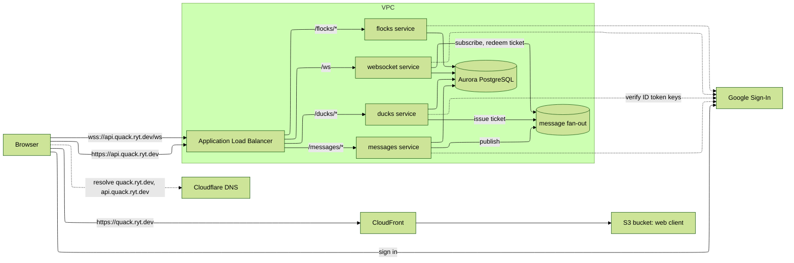

# Architecture

Quack is a set of Node services on ECS Fargate behind one Application Load Balancer, a static web client on S3 behind CloudFront, an Aurora PostgreSQL database, and a message fan-out that carries messages between tasks. Everything runs in one AWS account in us-east-1. Public hostnames are subdomains of quack.ryt.dev with DNS records in Cloudflare.

## Components

| Component                 | Runs as                                                                                                                                                                                                                 | Stack             |
| ------------------------- | ----------------------------------------------------------------------------------------------------------------------------------------------------------------------------------------------------------------------- | ----------------- |
| Cloudflare DNS            | Holds the zone for ryt.dev. DNS-only CNAME records point quack.ryt.dev at CloudFront and api.quack.ryt.dev at the load balancer, plus the CNAMEs that validate the certificates. Records are entered by hand.           | none, outside AWS |
| Web client                | Static files on S3, served by CloudFront at quack.ryt.dev                                                                                                                                                               | web               |
| Application Load Balancer | HTTPS listener on api.quack.ryt.dev; path rules to services; WebSocket upgrades pass through                                                                                                                            | cluster           |
| `ducks` service           | ECS Fargate service; sign-in, me, tickets, duck list                                                                                                                                                                    | ducks             |
| `flocks` service          | ECS Fargate service; flocks and memberships                                                                                                                                                                             | flocks            |
| `messages` service        | ECS Fargate service; send and history                                                                                                                                                                                   | messages          |
| `websocket` service       | ECS Fargate service; socket sessions and live delivery                                                                                                                                                                  | websocket         |
| Aurora PostgreSQL         | Serverless v2 cluster, one database, one table per entity, every table carrying pond_id. Each domain owns its tables and is their only writer; row-level security enforces pond and membership on every query (ADR-009) | data              |
| Message fan-out           | ElastiCache Valkey node; pub/sub topics between tasks, and the ticket handoff                                                                                                                                           | fanout            |
| Network                   | VPC, public subnets for the load balancer, protected subnets for tasks, private subnets with no route out for the data store and the fan-out node                                                                       | infra             |
| Certificates              | ACM in us-east-1; one for quack.ryt.dev on CloudFront, one for api.quack.ryt.dev on the load balancer; validated by CNAME in Cloudflare                                                                                 | web, cluster      |

## Request paths

HTTP: the browser sends the ID token as a bearer token. The load balancer routes by path to one service. The service verifies the token, applies the authorization rule for the route, reads or writes the data store, and responds. A send also publishes the message to the flock's fan-out topic.

WebSocket: the browser calls the ducks service's tickets route with its bearer token and receives a one-time ticket. It opens the socket with the ticket in the query string. The websocket service redeems the ticket, binds the socket to the user, and subscribes to the topic of each flock the user belongs to. When a message is published to a subscribed topic, the service pushes it to every socket on that task whose user is a member. On close it drops the socket and unsubscribes from topics no remaining socket needs. Sockets are held in task memory; no connection record is stored.

## Security

- Identity comes from an OpenID Connect ID token issued by Google to the web client. Every service verifies signature, issuer, expiry, and audience in code against Google's published keys, cached in memory (ADR-006). No credentials are stored.
- WebSocket upgrades from a browser cannot carry an Authorization header, so the socket path uses a ticket: a random value stored in the fan-out store with the user's identity and a short expiry, issued by the ducks service to an authenticated caller. Redeeming a ticket deletes it, so it is single use. An unknown or expired ticket closes the socket.
- A socket lives no longer than the ID token that opened it. The ticket carries the token's expiry; the websocket service closes the socket at that time, and the client obtains a fresh token, a fresh ticket, and reconnects.
- Authorization is record level: membership of the flock for any read or write to it, ownership for delete. Each service enforces the rule for its routes before touching the data store, and row-level security policies in the database enforce pond isolation and membership again on every query, keyed on the pond and caller the shared package sets at the start of each transaction.
- Each service connects to the database as its own database role with grants on its own domain's tables. Connections use IAM database authentication: the task role signs a short-lived token and the connection uses TLS. No database password exists.
- Tasks sit in protected subnets, which reach the internet through the NAT gateway. The data store and the fan-out node sit in private subnets with no route out of the VPC. Security groups allow the load balancer to the services, and the services to the data store and the fan-out node. Nothing else reaches them.
- The load balancer sets CORS response headers with the origin fixed to quack.ryt.dev.
- There is no request throttling in the MVP.

## Configuration

Deploy-time configuration lives in `config.json` at the repository root: the web hostname, the API hostname, the Google OAuth client ID, and the region. Every package reads it through the shared package. Identifiers a stack creates and another stack needs, such as the VPC, the cluster, and the listener, are shared case by case: the producing stack writes them to SSM parameters, or the consuming stack looks them up by name or tag. CloudFormation exports are not used. Services receive their values as environment variables set in their task definitions.

Runtime parameters, values that change without a redeploy, live in SSM Parameter Store and are read by the service at start. The MVP has none. Application secrets, when they exist, go in SSM as SecureString parameters and are read the same way. The MVP has none: the OAuth client ID is public by design, and database access uses IAM authentication.

## Cross-domain reads

Each domain owns its tables and is the only writer. A service may read another domain's tables under the rule in ADR-008, as a SELECT grant to its database role on those tables. Every such read is listed here.

Tickets are the one deliberate split: the ducks service issues a ticket into the fan-out store and the websocket service deletes it on redeem. The ticket is a handoff between the two, not a data store record, and ADR-008 does not apply to it.

| Reading service | Owning domain | Record     | Purpose                                                            |
| --------------- | ------------- | ---------- | ------------------------------------------------------------------ |
| messages        | flocks        | membership | Membership check before send and before history                    |
| websocket       | flocks        | membership | Topics to subscribe on connect; membership check before push       |
| flocks          | ducks         | duck       | Caller lookup on every request; display names when listing members |
| messages        | ducks         | duck       | Caller lookup on every request                                     |

## Ponds

A pond is a tenant. The MVP serves one pond with a fixed pond ID. Every record carries the pond ID in its key and every query is scoped by it. Multiple ponds is a named future enhancement (FC-01): the pond ID would come from the request context, such as a claim or the hostname, instead of a constant. Nothing else is built for it.

## Stacks

One repository. Each row is a CDK stack in its own project; independent stacks deploy in parallel.

| Stack                              | Contents                                                                                                   | Depends on            |
| ---------------------------------- | ---------------------------------------------------------------------------------------------------------- | --------------------- |
| infra                              | VPC, subnets, NAT gateway for image pulls and Google key fetches; shared parameters and roles              | none                  |
| data                               | Aurora cluster, subnet group, security group, schema migration                                             | infra                 |
| fanout                             | ElastiCache Valkey node, subnet group, security group                                                      | infra                 |
| cluster                            | ECS cluster, load balancer, HTTPS listener, certificate                                                    | infra                 |
| ducks, flocks, messages, websocket | Task definition, service, target group, listener rule, scaling policy, log group, database role and grants | cluster, data, fanout |
| web                                | S3 bucket, CloudFront distribution, certificate                                                            | none                  |

Shared code (token verification, data access, fan-out client, logging) is a workspace package used by every service.
