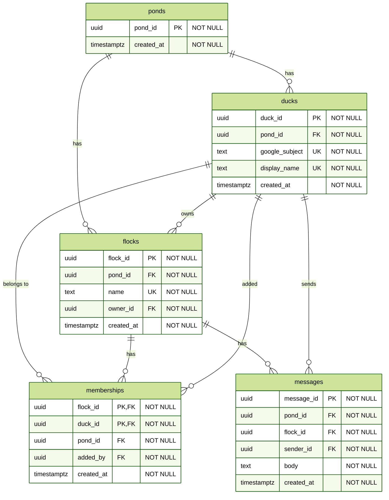

# Data model

The data store is one Aurora PostgreSQL database (ADR-009) with five tables: ponds, ducks, flocks, memberships, messages. Every row belongs to a pond. Each table is owned by one domain, which is its only writer; other domains read it under ADR-008 as a SELECT grant. Row-level security policies enforce pond isolation and flock membership on every query.

## Identifiers

Every identifier is a UUIDv7 ([RFC 9562, section 5.7](https://www.rfc-editor.org/rfc/rfc9562.html#section-5.7)), generated by the database as the column default with uuidv7() ([UUID functions](https://www.postgresql.org/docs/18/functions-uuid.html)). The first 48 bits are a millisecond timestamp, so IDs sort by creation time and the history index on messages returns send order. Generation needs no coordination between regions (FC-03). PostgreSQL compares uuid values bytewise, so ORDER BY message_id is time order.

The pond ID is the one row in ponds, inserted by the schema migration. The ducks service reads it at sign-in; every other request carries it in the path (architecture.md, Ponds).

## Entities

Primary keys are the entity's own ID; a membership's key is (flock_id, duck_id) because it has no ID of its own. pond_id is a plain column with a foreign key to ponds, and row-level security scopes every query to it.

**ponds**, owned by the migration. One row in the MVP, read by the ducks service at sign-in.

**ducks** (DE-01), owned by the ducks domain. Unique (pond_id, google_subject), the sub claim of the ID token, so one Google account can be a duck in more than one pond later. Unique (pond_id, display_name); it is how a member names the duck to add (FR-04). Display names come from Google and are not unique there, so a sign-in whose name collides with an existing duck fails. That is intentional for the demo; a production application would have each user choose a username, as Slack does. Email is read from the token to satisfy verification and is not stored (NFR-07). google_subject is used in one place: on each request the service looks up the caller's duck_id by it (flows/README.md). Every other table refers to a duck by duck_id and never stores google_subject, so a change of identity provider changes this one column and nothing else.

**flocks** (DE-02), owned by the flocks domain. Unique (pond_id, name); creating a flock with a name already in the pond is refused. owner_id is the creator and is not transferable.

**memberships** (DE-03), owned by the flocks domain. The flock foreign key is ON DELETE CASCADE. Index (duck_id, flock_id) serves a duck's flock list.

**messages** (DE-04), owned by the messages domain. The flock foreign key is ON DELETE CASCADE. Index (flock_id, message_id) serves history. body is checked at 4,000 characters or fewer (ASM-03); a row is at most a few tens of kilobytes, which meets NFR-10. message_id is time ordered, see Identifiers.

## Access patterns

Row-level security adds the pond filter to every query, so pond_id appears in no WHERE clause. The index is the primary key unless stated.

| AP    | Access pattern                                   | Query                                                                                                        | Service                         |
| ----- | ------------------------------------------------ | ------------------------------------------------------------------------------------------------------------ | ------------------------------- |
| AP-01 | Upsert user on sign-in                           | Insert a duck; if (pond_id, google_subject) already exists, update display_name instead                      | ducks                           |
| AP-02 | Read one user by duckId                          | Select a duck WHERE duck_id = ?                                                                              | ducks                           |
| AP-03 | Create flock                                     | Insert the flock, then insert the owner's membership, in one transaction                                     | flocks                          |
| AP-04 | Read one flock by flockId                        | Select a flock WHERE flock_id = ?                                                                            | flocks                          |
| AP-05 | Delete flock                                     | Delete the flock WHERE flock_id = ?; the cascade runs AP-10 and AP-13                                        | flocks                          |
| AP-06 | Check membership of one user in one flock        | Select a membership WHERE flock_id = ? AND duck_id = ?; the policies run the same check on every flock query | every service                   |
| AP-07 | List flocks for a user                           | Select memberships WHERE duck_id = ?, joined to flocks; uses the (duck_id, flock_id) index                   | flocks; websocket under ADR-008 |
| AP-08 | List members of a flock                          | Select memberships WHERE flock_id = ?, joined to ducks for display names                                     | flocks                          |
| AP-09 | Add membership                                   | Insert a membership                                                                                          | flocks                          |
| AP-10 | Delete all memberships in a flock                | Run by the cascade in AP-05                                                                                  | database                        |
| AP-11 | Put message                                      | Insert a message                                                                                             | messages                        |
| AP-12 | Read latest 50 messages in a flock, newest first | Select messages WHERE flock_id = ? ORDER BY message_id DESC LIMIT 50; uses the (flock_id, message_id) index  | messages                        |
| AP-13 | Delete all messages in a flock                   | Run by the cascade in AP-05                                                                                  | database                        |
| AP-16 | List ducks in the pond                           | Select ducks                                                                                                 | ducks                           |

AP-14 and AP-15 are not data store access patterns; sockets live in websocket task memory and delivery goes through the fan-out topic (ADR-005).

## Row-level security

Every table has row-level security enabled ([Row security policies](https://www.postgresql.org/docs/current/ddl-rowsecurity.html)). The db library opens a transaction for each request and sets transaction-local settings before any query: app.pond_id from the path, app.google_subject from the verified ID token, and app.duck_id once the caller's row is known. Sign-in has only the first two. Policies read them with current_setting. A query outside a transaction, or with a setting missing, fails with an error.

Membership is checked by a function is_member(flock_id, duck_id) that runs with the privileges of the table owner, so it reads memberships without recursing into the memberships policy. Ownership is checked the same way by is_owner(flock_id, duck_id). INSERT and UPDATE conditions are checked against the row as written.

| Table       | SELECT                              | INSERT                                                                                                                                                                          | UPDATE                                          | DELETE                               |
| ----------- | ----------------------------------- | ------------------------------------------------------------------------------------------------------------------------------------------------------------------------------- | ----------------------------------------------- | ------------------------------------ |
| ponds       | every row                           | none                                                                                                                                                                            | none                                            | none                                 |
| ducks       | pond matches                        | pond matches and google_subject is the caller's                                                                                                                                 | pond matches and google_subject is the caller's | none                                 |
| flocks      | pond matches and caller is a member | pond matches and owner_id is the caller                                                                                                                                         | none                                            | pond matches and caller is the owner |
| memberships | pond matches and caller is a member | two policies, either passes: create flock, caller is the flock's owner and duck_id is the caller; add member, caller is a member. Both: pond matches and added_by is the caller | none                                            | none in the MVP (FC-05)              |
| messages    | pond matches and caller is a member | pond matches and caller is a member, sender_id is the caller                                                                                                                    | none                                            | none                                 |

Foreign key cascades bypass row security, so deleting a flock removes its memberships and messages regardless of policy. Ducks are readable by every member of the pond because adding a member needs to find any signed-in user (FR-04).

A service enforces the same rules in code before its query so that a refused request gets a 403 rather than an empty result. The policies are the guarantee; the code is the error message.

## Roles and grants

One database role per service, each a member of rds_iam so it authenticates with an IAM token and holds no password ([IAM database authentication](https://docs.aws.amazon.com/AmazonRDS/latest/AuroraUserGuide/UsingWithRDS.IAMDBAuth.html)). Tables are owned by a separate migration role that the services are not members of, so row security applies to every service query. Cross-domain grants are those listed in architecture.md under ADR-008.

| Role          | ponds  | ducks                  | flocks                 | memberships    | messages       |
| ------------- | ------ | ---------------------- | ---------------------- | -------------- | -------------- |
| ducks_svc     | SELECT | SELECT, INSERT, UPDATE |                        |                |                |
| flocks_svc    | SELECT | SELECT                 | SELECT, INSERT, DELETE | SELECT, INSERT |                |
| messages_svc  | SELECT | SELECT                 |                        | SELECT         | SELECT, INSERT |
| websocket_svc | SELECT |                        |                        | SELECT         |                |

The cascade on flock delete runs under the owner of the referencing tables, so flocks_svc needs no grant on messages to delete a flock.

## Schema changes

Tables and indexes are a Drizzle schema in the db library; roles, functions, policies, and grants are one custom SQL migration beside it. Both are applied by a migration step at deploy. The mechanism is in operational-design.md.
