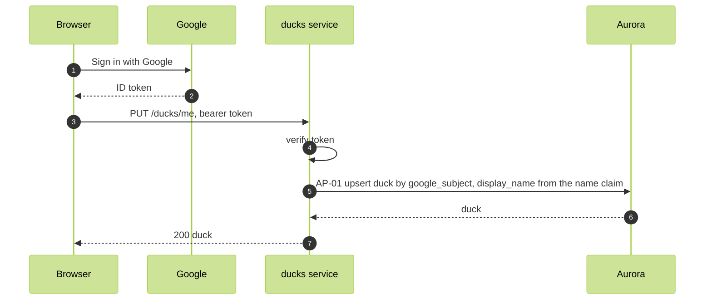

# Sign in

FR-01, WFL-01. The browser obtains a Google ID token and signs in. Sign-in creates or updates the duck and returns it, so the client holds its own duckId and displayName.

Routes, ducks service:

- `PUT /ducks/me`. Upserts the duck from the token. Response 200 `{ duckId, displayName }`.
- `GET /ducks/me`. Returns the duck. No side effects.

Authorization: a verified token. Sign-in skips the resolve step, since the duck may not exist yet. The upsert is scoped to the token's own subject by the ducks INSERT and UPDATE policies.

Refusals: 401 on a token failure; 409 when the name claim matches another duck's display_name in the pond.

A name change at Google reaches the duck on the next sign-in. The client holds the token until its exp claim ([ID token claims](https://developers.google.com/identity/openid-connect/openid-connect#an-id-tokens-payload)), then obtains a fresh one from Google and signs in again before continuing.
