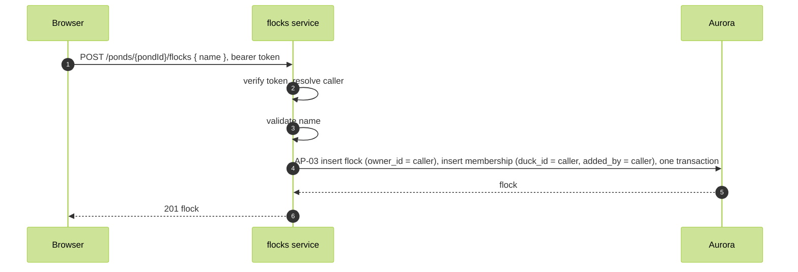

# Create flock

FR-02, WFL-02. A signed-in duck creates a named flock and becomes its owner and first member.

Route: `POST /ponds/{pondId}/flocks`, flocks service. Body `{ name }`. Response 201 `{ flockId, name, ownerId }`.

Authorization: a verified token. The flocks INSERT policy requires owner_id to be the caller; the memberships create-flock policy requires the caller to be the flock's owner and the row's duck_id.

Refusals: 400 on an empty name; 409 when the name exists in the pond.
