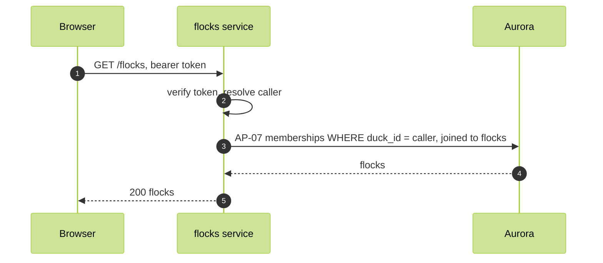

# List flocks

FR-03, WFL-03. A duck lists the flocks they belong to.

Route: `GET /flocks`, flocks service. Response 200 `[{ flockId, name, ownerId }]`.

Authorization: a verified token. The query is keyed on the caller, and the flocks SELECT policy returns only flocks the caller is a member of.

Refusals: 401 only. An empty list is 200.
