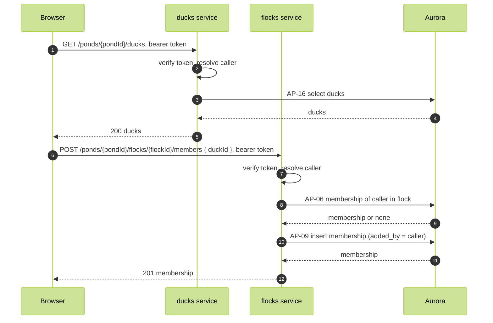

# Add member

FR-04, WFL-04. A member adds another duck to a flock. The client holds the pond's ducks, ID and name, from the ducks list, and sends the ID.

Routes:

- `GET /ponds/{pondId}/ducks`, ducks service. Response 200 `[{ duckId, displayName }]`, every duck in the pond.
- `POST /ponds/{pondId}/flocks/{flockId}/members`, flocks service. Body `{ duckId }`. Response 201 `{ flockId, duckId }`.

Authorization: the caller is a member of the flock (AP-06). The memberships add-member policy requires the caller to be a member and added_by to be the caller.

Refusals: 403 when the caller is not a member; 404 when duckId matches no duck, from the foreign key; 409 when the duck is already a member.

The new member's open sockets are not subscribed to the flock (README.md, Live delivery).
