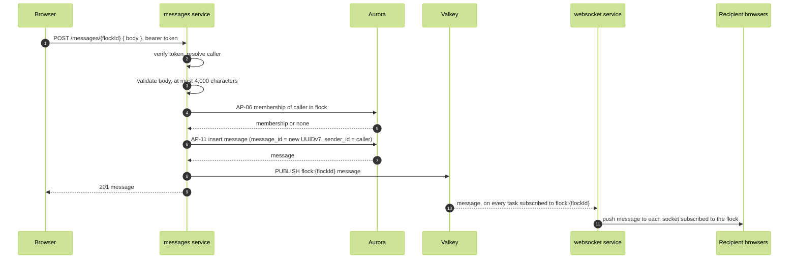

# Send message

FR-05, FR-06, WFL-05. A member sends a message to a flock. Connected members receive it through the fan-out.

Route: `POST /messages/{flockId}`, messages service. Body `{ body }`. Response 201 `{ messageId, flockId, senderId }`.

Authorization: the caller is a member of the flock (AP-06). The messages INSERT policy requires the caller to be a member and sender_id to be the caller.

Refusals: 400 when body is empty or over 4,000 characters (ASM-03); 403 when the caller is not a member.

The message is committed before it is published, so a recipient who reloads history sees everything they were pushed. The sender's own sockets receive the push as well; the client ignores a message whose messageId it already holds. The socket message is `{ "type": "message", "message": { messageId, flockId, senderId, body, createdAt } }`, the same record history returns.

The publish is fire and forget (ADR-005). A task that is between reconnects misses it; its clients recover by reloading history.
