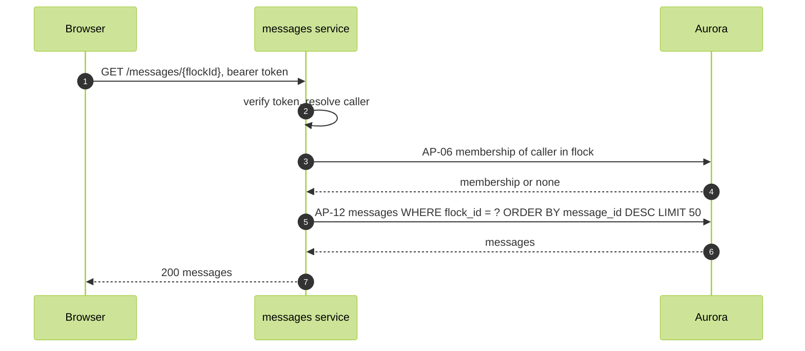

# Load history

FR-07, WFL-06. A member opening a flock loads its most recent messages.

Route: `GET /messages/{flockId}`, messages service. Response 200 `[{ messageId, flockId, senderId, body, createdAt }]`, 50 at most, newest first.

Authorization: the caller is a member of the flock (AP-06). The messages SELECT policy returns rows only to a member.

Refusals: 403 when the caller is not a member.

The client renders the page in send order, oldest at the top, and appends pushed messages after it. Opening a flock loads history after the socket is subscribed, so a message that arrives during the load is either in the page or pushed; the client drops a pushed message whose messageId the page already holds.
