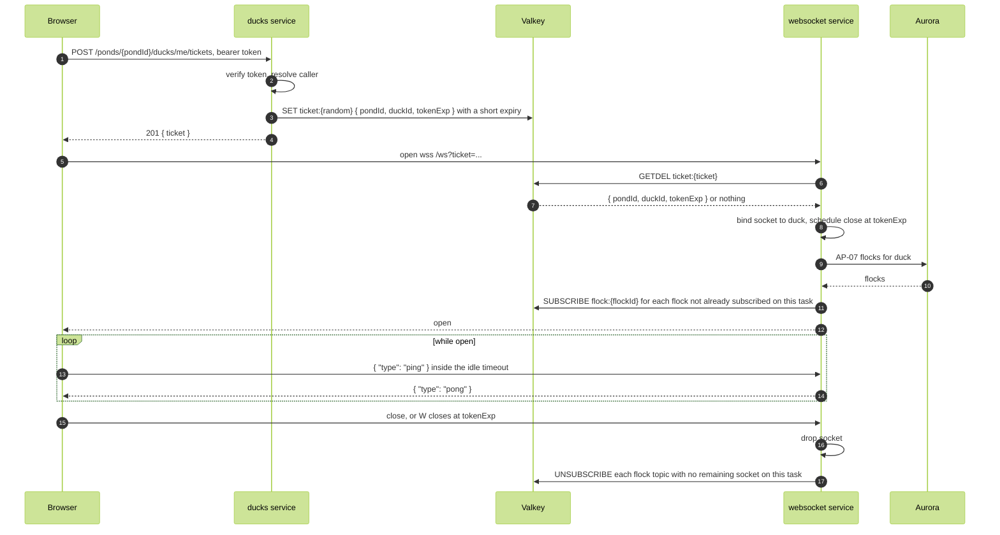

# Connect and disconnect

WFL-07, AP-14. A duck opens one WebSocket for live delivery and it is cleaned up on close.

Routes:

- `POST /ponds/{pondId}/ducks/me/tickets`, ducks service. Response 201 `{ ticket }`.
- `wss://api.quack.ryt.dev/ws?ticket={ticket}`, websocket service.

Authorization: the ticket. It is issued only to a verified caller, carries the caller's identity, and is deleted when redeemed, so it is single use. An unknown or expired ticket closes the socket with an application close code ([RFC 6455, section 7.4.2](https://www.rfc-editor.org/rfc/rfc6455#section-7.4.2)). The websocket service takes duckId from the ticket and does not read the ducks table. The memberships SELECT policy returns only the caller's own memberships.

The socket lives no longer than the ID token that issued the ticket. Before tokenExp the client obtains a fresh token from Google, requests a new ticket, opens a new socket, and closes the old one; while both are open it drops duplicate messageIds. A closed socket is followed by a history reload on the open flock, which recovers anything missed while disconnected (ADR-005).

The ping keeps the connection inside the load balancer's idle timeout (ADR-004).

Each task holds its sockets in memory: a map from socket to duckId and flock set, and a map from flock topic to the sockets on that task. No connection record is stored (DE-05).
