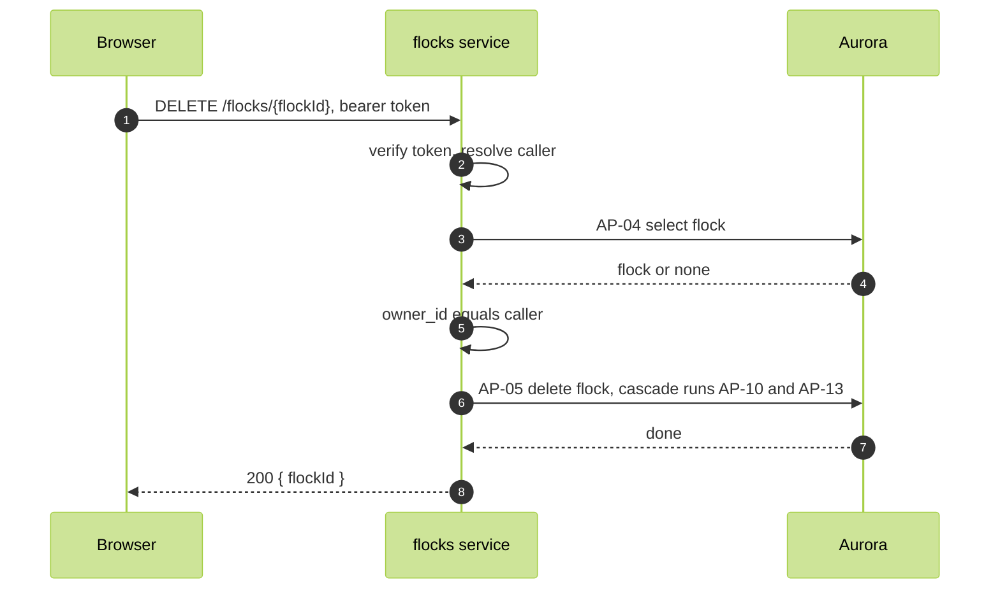

# Delete flock

FR-08, WFL-08. The owner deletes a flock. Its memberships and messages go with it.

Route: `DELETE /flocks/{flockId}`, flocks service. Response 200 `{ flockId }`.

Authorization: the caller is the owner. AP-04 returns the flock only to a member, and the code compares owner_id to the caller. The flocks DELETE policy requires the caller to be the owner. The cascades run under the owner of the referencing tables and bypass row security.

Refusals: 403 when the flock is not visible to the caller or the caller is not its owner.

Subscribed sockets are not told (README.md, Live delivery).
