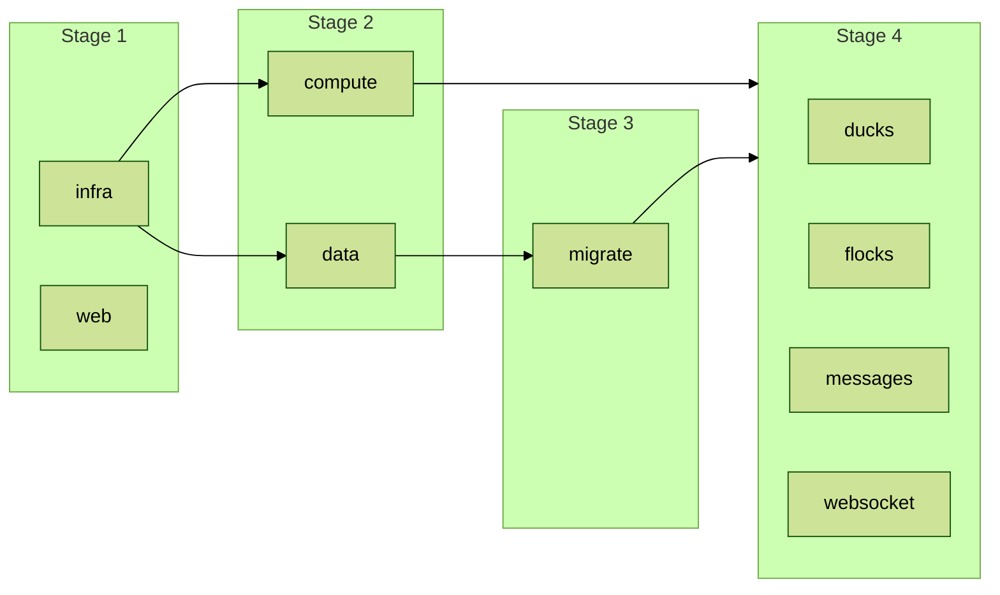

# Operational design

Configuration, secrets, and ponds are in architecture.md.

## Deploy

GitHub Actions deploys on every push to main. Each stack is its own CDK app and its own job. A job assumes the deploy role through GitHub's OpenID Connect provider ([Configuring OpenID Connect in AWS](https://docs.github.com/en/actions/security-for-github-actions/security-hardening-your-deployments/configuring-openid-connect-in-amazon-web-services)) and runs `cdk deploy` for its package; no long-lived AWS credential exists in GitHub. CDK builds each service's container image on the runner and pushes it to the bootstrap image repository ([Assets](https://docs.aws.amazon.com/cdk/v2/guide/assets.html)).

The deploy role may assume the CDK bootstrap roles ([Bootstrapping](https://docs.aws.amazon.com/cdk/v2/guide/bootstrapping.html)). The migrate role holds only the Data API, master secret, and SSM parameter permissions the migration needs. Both trust one GitHub Environment and nothing else; which branches may deploy to that environment is a rule on the environment in GitHub. Both come from `packages/infra/BootstrapIam.yaml`, applied once per account outside the CDK app (README, Setup).

`cdk deploy` from a developer machine is the path for initial setup and troubleshooting. Both paths run the same apps from the same configuration.

## Data store

| Setting             | Value                                                                                                                                                |
| ------------------- | ---------------------------------------------------------------------------------------------------------------------------------------------------- |
| Engine              | Aurora PostgreSQL 17.9, Serverless v2                                                                                                                |
| Instances           | One writer, 0 to 2 ACU, pauses after one idle hour                                                                                                   |
| Database            | `quack`                                                                                                                                              |
| Master user         | `postgres`; password generated and managed by RDS in Secrets Manager                                                                                 |
| Deletion protection | Off, and the cluster is deleted with the stack, so Phase 4 can destroy and redeploy. Production turns it on and retains the cluster on stack delete. |

The data stack publishes these SSM parameters:

| Parameter                            | Value                     | Reader         |
| ------------------------------------ | ------------------------- | -------------- |
| /quack/data/cluster-arn              | cluster ARN               | migrate job    |
| /quack/data/secret-arn               | master secret ARN         | migrate job    |
| /quack/data/endpoint                 | writer endpoint hostname  | service stacks |
| /quack/data/security-group-id        | cluster security group ID | service stacks |
| /quack/data/valkey-endpoint          | Valkey primary endpoint   | service stacks |
| /quack/data/valkey-security-group-id | Valkey security group ID  | service stacks |

A bastion host in the same stack gives a developer machine a path to the cluster through Session Manager port forwarding (README, Local database access).

The fan-out node is in the same stack: one cache.t4g.micro Valkey node in the private subnets, TLS in transit, reached on 6379 from the services' security groups.

## Schema migration

The Drizzle schema and its migrations folder live in the db library, `packages/libs/db`. `drizzle-kit generate` writes the tables migration from the schema; roles, functions, policies, and grants are a custom SQL migration beside it. Statements in custom files are separated by Drizzle's statement-breakpoint marker, one per Data API call.

The migrate job runs after the data stack and before the service stacks. It assumes the migrate role, reads the cluster ARN and secret ARN from the /quack/data/ parameters, waits for a paused cluster to resume, and runs `drizzle-kit migrate` through the RDS Data API with the master secret. Only the migration uses the Data API and the master secret; services connect with IAM authentication as their own roles. The Data API client is pinned to 3.873.0 in `pnpm-workspace.yaml`; `drizzle-kit migrate` fails with newer versions ([drizzle-orm issue 5050](https://github.com/drizzle-team/drizzle-orm/issues/5050)).

## Logging

Each service writes one JSON line per request to standard output through a function in the shared package, and the awslogs driver ships it to the service's CloudWatch log group. The line carries the request ID, duck, flock, action, outcome, status, and duration (NFR-09). Token failures log the reason and no token. Message bodies are not logged. No logging library is used.

Log groups keep one week of logs. At production scale the retention rises to 60 days ([PutRetentionPolicy](https://docs.aws.amazon.com/AmazonCloudWatchLogs/latest/APIReference/API_PutRetentionPolicy.html)).

## Cost

Monthly figures. Demo is one month at near-zero load; at scale is the Scale and Estimates sheet's peak. Calculator estimates are the ones linked from the ADRs.

| Line                               | Demo                                          | At scale                                                                                                                                             | Source                                                                                                                 |
| ---------------------------------- | --------------------------------------------- | ---------------------------------------------------------------------------------------------------------------------------------------------------- | ---------------------------------------------------------------------------------------------------------------------- |
| Fargate, four services             | about $36, the smallest task per service      | about $7,300                                                                                                                                         | ADR-003, estimates 003-C and 003-A                                                                                     |
| Application Load Balancer          | about $16                                     | about $8,800, active connections                                                                                                                     | ADR-004, estimate 004-A                                                                                                |
| Valkey on ElastiCache              | about $9, one node                            | about $280, three nodes                                                                                                                              | ADR-005, estimates 005-A and 005-B                                                                                     |
| Aurora PostgreSQL                  | about $44, never pausing                      | about $23,000                                                                                                                                        | ADR-009, estimates 009-C and 009-E                                                                                     |
| NAT gateway                        | about $33, one gateway at $0.045 per hour     | about $100 for three gateways plus the interface endpoints of the scaling limits table                                                               | [VPC pricing](https://aws.amazon.com/vpc/pricing/), [PrivateLink pricing](https://aws.amazon.com/privatelink/pricing/) |
| Public IPv4 addresses              | about $11, three addresses at $0.005 per hour | about $50: three NAT gateway addresses plus an assumed ten on the load balancer, whose count scales with load                                        | [VPC pricing](https://aws.amazon.com/vpc/pricing/)                                                                     |
| Secrets Manager, the master secret | $0.40                                         | $0.40                                                                                                                                                | [Secrets Manager pricing](https://aws.amazon.com/secrets-manager/pricing/)                                             |
| Bastion host                       | about $3, one t4g.nano                        | about $3                                                                                                                                             | [EC2 On-Demand pricing](https://aws.amazon.com/ec2/pricing/on-demand/)                                                 |
| CloudWatch Logs                    | within the free tier                          | about $3,600: 21.6 billion request lines at an assumed 300 bytes is about 6.5 TB ingested at $0.50 per GB, plus 60 days stored at $0.03 per GB-month | [CloudWatch pricing](https://aws.amazon.com/cloudwatch/pricing/)                                                       |
| CloudFront and S3, the web client  | within the always-free tier                   | about $2,500: an assumed one full client load per user per week at 0.5 MB and 10 requests, 26 TB and 520 million requests, at United States rates    | [CloudFront pricing](https://aws.amazon.com/cloudfront/pricing/pay-as-you-go/)                                         |
| RDS Data API, migrations only      | within the free tier                          | rounds to zero: a deploy is a few dozen requests at $0.35 per million                                                                                | [Aurora pricing](https://aws.amazon.com/rds/aurora/pricing/)                                                           |
| Total                              | about $150                                    | about $46,000                                                                                                                                        |                                                                                                                        |

At scale that is about $0.002 per 1,000 HTTP requests (SC-09). Annual operating expense is about $1,800 at demo load and about $550,000 at scale (BUD-04).

## Scaling limits

Where the MVP design stops and what changes.

| Component                 | Limit                                                                                                                                                                                                                                                                                                                                                                                       | What changes                                                                                                                                                                                                                                                  |
| ------------------------- | ------------------------------------------------------------------------------------------------------------------------------------------------------------------------------------------------------------------------------------------------------------------------------------------------------------------------------------------------------------------------------------------- | ------------------------------------------------------------------------------------------------------------------------------------------------------------------------------------------------------------------------------------------------------------- |
| websocket service         | 50,000 sockets per task, an assumption on the Scale and Estimates sheet checked by the Phase 3 load test. 8.4 million peak connections is about 170 tasks.                                                                                                                                                                                                                                  | Nothing in the design; the service scales on connection count. If the measured figure is lower, the task count rises in proportion.                                                                                                                           |
| Application Load Balancer | 1,000 targets per target group and per load balancer by default, adjustable ([ALB quotas](https://docs.aws.amazon.com/elasticloadbalancing/latest/application/load-balancer-limits.html)). 170 websocket tasks fit. Capacity units scale with load and the active-connection charge is the largest cost line (ADR-004).                                                                     | Move the socket path to a Network Load Balancer with TLS in the task when the active-connection charge is material (ADR-004).                                                                                                                                 |
| ECS on Fargate            | 5,000 tasks per service. Fargate On-Demand vCPUs per region default to 6, adjustable and raised automatically with use; the demo's four smallest tasks use 1. A service launches at most 500 tasks per minute and the account 20 per second sustained ([ECS quotas](https://docs.aws.amazon.com/general/latest/gr/ecs-service.html)).                                                       | Request the vCPU quota before a load test above the demo size. The launch rate bounds how fast the websocket fleet grows at the start of a day (AP-14); scale-out thresholds are set from the load test.                                                      |
| Aurora PostgreSQL         | One writer instance. Serverless v2 caps max_connections at 2,000 when the minimum capacity is 0 or 0.5 ACU and at 5,000 otherwise ([Serverless v2 capacity](https://docs.aws.amazon.com/AmazonRDS/latest/AuroraUserGuide/aurora-serverless-v2.setting-capacity.html)). Every task holds a pool, so 170 websocket tasks plus the HTTP fleet exceed that.                                     | RDS Proxy in front of the cluster, priced in ADR-009 estimate 009-E, and provisioned instances at scale. Shard ponds across clusters when one writer's ceiling is reached (ADR-009).                                                                          |
| Valkey on ElastiCache     | One node in the MVP. A single node's publish throughput is not published; the load test measures it. Cluster mode allows 90 nodes per cluster ([ElastiCache quotas](https://docs.aws.amazon.com/AmazonElastiCache/latest/dg/quota-limits.html)).                                                                                                                                            | Cluster mode with sharded pub/sub (ADR-005). Missed messages during task restarts become unacceptable: Valkey streams or MSK for replay (ADR-005).                                                                                                            |
| NAT gateway               | Bills per hour and per gigabyte processed ([VPC pricing](https://aws.amazon.com/vpc/pricing/)). Every image pull, log write, and parameter read from every task crosses it, so the data charge grows with task count. At demo volume the data charge is smaller than the hourly charge of a single interface endpoint ([PrivateLink pricing](https://aws.amazon.com/privatelink/pricing/)). | At production scale, add interface endpoints for ECR, CloudWatch Logs, and SSM and the S3 gateway endpoint, so that traffic stays on the AWS network and off the NAT data charge. The NAT gateway remains for the Google key fetch, which no endpoint covers. |
| RDS Data API              | Cancels any statement after 45 seconds ([Timeouts](https://docs.aws.amazon.com/AmazonRDS/latest/AuroraUserGuide/data-api-timeouts.html)). Every MVP migration statement finishes in well under that.                                                                                                                                                                                        | A migration that rebuilds an index or rewrites a large table, such as messages at scale, runs the migrator from inside the VPC over a direct connection, for example a one-off ECS task, instead of the Data API.                                             |
